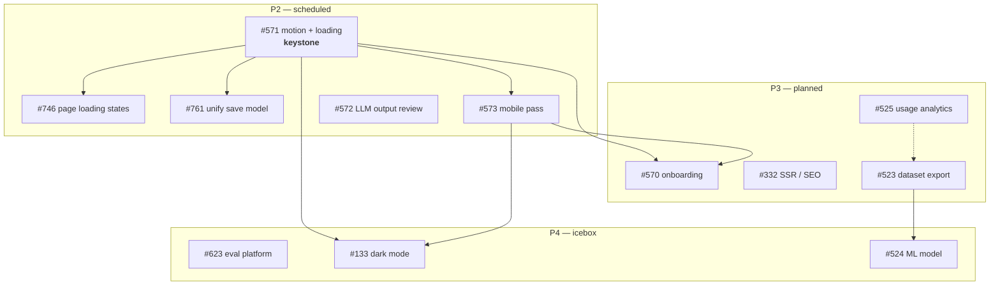

# Open-issue backlog — order and priority

> **Written:** 13 Aug 2026 · **Last updated:** 16 Aug 2026, after #797, #764 and
> #763 closed. · **Basis:** all **12** open issues in
> `Smart-Apply/applo`, read in full via `gh issue list --state open`.
> **Verified against:** `main` @ `487e08c4` (`feat(profile): validate the four
> unchecked profile editor dialogs`, PR #804).
>
> Every "current state" line below was re-checked against the code on `main`,
> not copied from the issue body. Where an issue disagrees with the code — or
> with an external source — the disagreement is recorded in
> [Corrections](#corrections-found-while-ordering) rather than propagated.
>
> This file answers *what order and why*. The `NN-*.md` plans next to it answer
> *how*, and [README.md](./README.md) sequences the plans (including four items
> that have no issue at all — see [Not on this list](#not-on-this-list)).

---

## Priority scale

| Priority | Meaning |
|---|---|
| **P1** | Next up. Unblocked, small, and either a correctness/data-loss risk or a legal/accessibility exposure. |
| **P2** | Scheduled. Real product value; either larger, or waiting on a P1/keystone to land first. |
| **P3** | Planned, not scheduled. Valuable but not load-bearing, or its content depends on P2 changing the UX underneath it. |
| **P4** | Icebox. Needs an input that does not exist yet (data volume, a settled design system, a separate repo). |

**Size** is scope, not schedule:

| Size | Scope |
|---|---|
| **S** | One PR, one area, the patterns already exist in the repo. |
| **M** | One or two PRs; introduces a shared primitive or needs a small decision. |
| **L** | Multi-PR, cross-cutting, needs a product decision before code. |
| **XL** | Its own workstream or repository. |

---

## The order

| # | Issue | Title | Prio | Size | Blocked by |
|---:|---|---|---|---|---|
| 1 | [#571](https://github.com/Smart-Apply/applo/issues/571) | Übergänge neu designen + Lade-Animationen | **P2** | M | — *(keystone)* |
| 2 | [#746](https://github.com/Smart-Apply/applo/issues/746) | Loading State für die Seite bauen | **P2** | S | #571 |
| 3 | [#761](https://github.com/Smart-Apply/applo/issues/761) | Speicher-Modell vereinheitlichen und Erfolgs-Feedback bauen | **P2** | L | #571 + a decision |
| 4 | [#573](https://github.com/Smart-Apply/applo/issues/573) | Mobiles Design (Android/iOS) überarbeiten | **P2** | L | #571 |
| 5 | [#572](https://github.com/Smart-Apply/applo/issues/572) | Generierungs-Output prüfen & Verbesserungspotenziale identifizieren | **P2** | M | — *(unblocked by #797)* |
| 6 | [#570](https://github.com/Smart-Apply/applo/issues/570) | Onboarding-Guide für alle Features | **P3** | L | #571, #573 |
| 7 | [#332](https://github.com/Smart-Apply/applo/issues/332) | Add SSR to public pages (landing, marketing) for SEO | **P3** | M | plan 03 |
| 8 | [#525](https://github.com/Smart-Apply/applo/issues/525) | LLM token-usage analytics aggregation endpoints | **P3** | M | — *(its data only exists since #803)* |
| 9 | [#523](https://github.com/Smart-Apply/applo/issues/523) | Anonymized usage dataset export for ML/due-diligence | **P3** | M | re-scope first |
| 10 | [#623](https://github.com/Smart-Apply/applo/issues/623) | Evaluation platform for application generation — separate repo | **P4** | XL | — *(unblocked by #797)* |
| 11 | [#133](https://github.com/Smart-Apply/applo/issues/133) | 🌙 Dark Mode — Theme Switcher | **P4** | M | #571, #573 |
| 12 | [#524](https://github.com/Smart-Apply/applo/issues/524) | Model trained on anonymized AI-usage dataset (discovery) | **P4** | XL | #523 + data volume |

**Ordering principle:** finish what is already open before starting what is
not. Rank 1 is a keystone — three later issues explicitly say they should
build on it — so it comes before its dependents rather than after, even though
nothing forces that order technically. With #763 closed there is no open P1
left; the list now starts at P2.

---

## Closed since this file was written

| Issue | Closed by | Carried over |
|---|---|---|
| **#790** a11y: dashboard, applications, settings | PR [#792](https://github.com/Smart-Apply/applo/pull/792) | **two items — see below** |
| **#780** Löschen im Profil umkehrbar machen | PR [#793](https://github.com/Smart-Apply/applo/pull/793) | none |
| **#797** reconcile the headless generation seam | PRs [#801](https://github.com/Smart-Apply/applo/pull/801) + [#802](https://github.com/Smart-Apply/applo/pull/802) | none — closing it unblocked #572 and #623 |
| **#764** Eingabe-Validierung für Profilfelder | PR [#804](https://github.com/Smart-Apply/applo/pull/804) | **one item — see below** |
| **#763** Profil-Check sortieren und Abschlusszustand bauen | _PR pending — fill in on merge_ | none |

Five removals are why the numbering above starts at #571. #797 also **promoted
#572 from P3 to P2**: the harness it was waiting on now exists.

**#790 left two things unticked, and closing the issue removed their home.**
Neither is covered by another open issue, so they will be lost unless filed:

1. **The VoiceOver pass has still never been done.** It carried from #765 to
   #790 and is now carried past #790. Every accessibility check to date is
   automated. A human listening pass is what catches reading order that is
   technically valid but nonsensical, over-verbose labels, and whether the
   German announcements actually sound right. PR #792 says explicitly that it
   should happen before WCAG conformance is claimed publicly.
2. **The 0-violation result was measured against DOM fixtures, not the running
   app.** `next build` could not run in the authoring sandbox (Google Fonts
   fetch), so axe-core 4.12 ran against reproductions of each affected region.
   The before arm reproduces the issue's counts exactly, which is good evidence
   — but `/settings`' `aria-hidden-focus` went *incomplete → pass* only because
   jsdom has no layout for axe to resolve focusability against. That is not the
   same as a pass. PR #792 itself flags it as "worth re-measuring against a
   running stack".

Both are small. Suggested: one issue, **P1**, "verify the a11y result on a
running stack + VoiceOver pass" — re-run the harness against `pnpm dev` on all
five audited routes, then listen to them.

**#764 left one item unticked, and closing it removed that item's home too.**
*"E-Mail-Format prüfen und Status-Icon konsistent setzen."* PR #804 ticked every
other box. Email is **read-only** in the contact dialog (immutable text beside a
`Mail` icon) and `profileSchema.email` has carried `.email()` all along, so there
is no input left to validate — what is missing is a product decision about where
a verification/status icon belongs at all. Small, and currently tracked nowhere.

---

## P2 — scheduled

### 1 · #571 — motion and loading foundation *(keystone)*

**What it does.** Route transitions, a reusable skeleton/loading component set,
a progress animation bound to the SSE generation status, unified
micro-interactions, `prefers-reduced-motion` support.

**Why here, and why before its dependents.** #746 and #573 both say in their own
acceptance criteria that they must be consistent with #571; #761 needs a
feedback primitive that #571 defines. Landing it first means one set of
primitives instead of several ad-hoc ones. It is the single highest-leverage
scheduling decision in this list.

**One job just got bigger, not smaller.** #780 shipped its undo toast as a
page-local `removeWithUndo` `useCallback` inside
`app/(dashboard)/profile/page.tsx` — reused by all six profile sections, but
not promoted to `lib/toast.ts`, where `toastErrorWithRetry` and
`toastNetworkError` already live. So #571 now has an existing implementation to
lift and generalise rather than a blank slate. Lift it; do not write a second
one beside it.

**Watch:** `apps/web` ships to Cloudflare Workers and the Sentry SDK already
costs ~519 KiB gzipped of the script budget. Any animation dependency needs a
bundle check before merge — see [plan 01](./01-error-monitoring.md).

**Plan:** [07](./07-issue-571-motion-foundation.md).

### 2 · #746 — page loading states

**What it does.** A visible loading state on initial page load and for
data-dependent regions, a reusable skeleton, an error state, and no layout shift
on the transition to loaded content.

**Why P2 and here.** It is essentially #571 applied per route, and the issue
says so. Doing it first would mean inventing the primitive twice.

**Depends on:** #571. **Plan:** [08](./08-issue-746-loading-states.md).

### 3 · #761 — unify the save model

**What it does.** Picks *one* save model for the product and justifies it, adds
an "all changes saved" indicator wherever autosave applies, unifies success
feedback, makes save failures visible with a retry, and adds an unsaved-changes
guard wherever explicit saving survives.

**Verified premise.** Three different models coexist: `/profile` saves per
dialog, `/settings` uses a sticky save bar that appears when dirty, and the
application editor autosaves silently via `POST /applications/:id/cover-letter`
(deliberately exempt from the `llm-actions` throttle for exactly that reason).
The issue's original claim of data loss when navigating away from `/profile` is
**not** true — the dialog holds the change until saved or cancelled.

**Why P2 and last of the profile group.** The code is not the hard part; the
product decision is. Making it after #746 means the decision is taken with the
new feedback primitives already in hand — and it now also inherits #780's
shipped undo toast as a fourth behaviour to reconcile, not a third.

**Depends on:** #571 + an explicit decision.

### 4 · #573 — mobile design pass

**What it does.** Touch-sized targets, mobile navigation, mobile-usable profile
and application forms, a PDF preview/editor that works on a small screen, iOS
Safari specifics (safe-area, 100vh, ≥16px inputs to stop input zoom), Android
Chrome checks, optional PWA polish.

**Why P2, and a caveat.** Job seekers browse on phones, so the business case is
strong. But Phase 2 triage already found that part of the premise is stale — the
dashboard shell **already has a drawer and a bottom nav**. Audit first against
`main`, then scope; do not implement the issue as written.

**Depends on:** #571. **Plan:** [09](./09-issue-573-mobile.md).

### 5 · #572 — review generation output quality

**What it does.** A structured review of the shipped generation output across
several professions (healthcare, sales, trades, marketing, IT) in DE and EN,
categorising weaknesses (faithfulness, ATS coverage, tone, PDF formatting,
cover-letter structure), then writing prioritised follow-ups into
[LLM_OUTPUT_QUALITY.md](../implementation/LLM_OUTPUT_QUALITY.md).

**Why it needs a harness, not a read-through.** Quality work needs a metric that
can resolve the effect, otherwise the conclusion is noise. A per-item pass/fail
over ~24 fixtures has a 95 % CI of roughly ±14 pp — wide enough to "detect"
improvements that did not happen. It needs a harness that pools the underlying
findings rather than collapsing them to per-item verdicts.

**That harness now exists** — see [#623](#11--623--evaluation-platform).
`applo-eval` already carries 31 fixtures across 14+ professions in DE and EN and
scores them with the product's own deterministic validators (grounding,
style-lint, ATS coverage, guard-fallback rate). Running #572 by hand would
re-do, worse, what is already built. Now that #797 has landed this stops being a
manual review and becomes a matrix run with a report.

**Depends on:** nothing — #797 closed (PRs #801/#802), which is what promoted
this from P3 to P2. **Plan:** [10](./10-issue-572-llm-output-review.md).

---

## P3 — planned, not scheduled

### 6 · #570 — onboarding guide

**What it does.** A guided first-login tour across profile/résumé import, job
ingestion, generation, the PDF editor, the interview coach and email tracking,
skippable, re-openable, with per-user progress in `user-preferences`.

**Why P3.** Large, and it documents the exact UX that #571, #746, #573 and #761
are about to change. Building it now guarantees rework. It also still has two
open design questions in the issue (interactive tour vs. static checklist; a
library vs. existing primitives) — decide those before planning.

### 7 · #332 — SSR for public pages

**What it does.** Converts the landing/marketing pages from client rendering to
Server Components with real `metadata`/OpenGraph, for indexability and FCP.

**Why P3.** It overlaps [plan 03](./03-seo-og.md), which covers SEO and social
share assets and is cheaper. Fold #332 in only if plan 03 shows the landing
page's CSR is actually hurting indexing — measure before rewriting.

### 8 · #525 — admin LLM usage analytics endpoints

**What it does.** Read-only, admin-gated aggregation over `LlmUsageEvent` —
tokens, cost, call counts and success rate grouped by feature, tier, language
and day, under `/api/v1/admin/llm-usage/*` behind the existing `ADMIN_EMAILS`
allow-list.

**Status change.** Its blocker **#522 is merged** (PR #781) — but until
**16 Aug 2026 it wrote nothing at all**. `llm_usage_events` was empty in *every*
environment: `LlmUsageService` declared Prisma as a union-typed `@Optional()`
parameter, TypeScript emitted `Object` for `design:paramtypes`, Nest could not
derive the token and silently injected `undefined`, and `record()` returned early
with no error ever logged. Fixed in PR
[#803](https://github.com/Smart-Apply/applo/pull/803) and verified on staging.
Rows only accrue from that deploy onward.

**Why P3.** Nothing depends on it, and the data only started accumulating on
16 Aug 2026. It becomes useful in proportion to how long tracking has actually
been running — which is an argument for doing it later, not sooner.

**Constraint to carry over:** aggregates only. No drill-down that could resolve
an `actorHash` back to a user.

### 9 · #523 — usage dataset export

**What it does.** An admin-only export of `LlmUsageEvent` to CSV/Parquet/JSONL,
with the schema and its anonymity guarantees documented for due diligence.

**Why it needs re-scoping before it is worked.** The issue's central promise —
"demonstrably anonymous" — is no longer accurate. The F11 finding in the
13 Aug security audit established that the dataset is **pseudonymous**:
`actorHash` is stable per user, and neighbouring tables (`applications`,
`validations`, `interview_sessions`) carry `userId` plus millisecond
`createdAt`, so a usage burst time-correlates back to the triggering row
*without* the salt. That is why erasure-on-account-deletion and a retention
sweep were added. An export sold as anonymous would be wrong.

**Re-scope to:** timestamp bucketing, `actorHash` re-salting or dropping per
export, and a k-anonymity threshold — or state plainly that the artefact is
pseudonymous and handle it as personal data.

---

## P4 — icebox

### 10 · #623 — evaluation platform

**What it does.** A standalone repo that runs a versioned fixture set
(profile × job posting, DE/EN, across professions and edge cases) through the
generation pipeline under a matrix of variants — model per call, prompt version,
reasoning effort, params, pipeline toggles — and scores each on quality, cost
and latency against a baseline. Its one in-repo enabler is a headless,
config-driven `generate(profileJson, jobJson, config)` with no persistence.

**It is not "not started" — it is largely built, and unbacked up.** The repo
exists at `/Users/arian/VS-Projects/applo-eval` (branch `master`, 2 commits,
359 files) with milestones M2–M4 already done: 31 fixtures (15 DE / 16 EN, 14+
professions, 7 edge cases, PII-linted), 6 model-per-call variants, the matrix
runner with immutable run artifacts, and a Next.js insights dashboard
(leaderboard, Pareto trade-off, side-by-side content inspector). Quality signals
are deterministic and come from the product's own validators — grounding,
style-lint, ATS coverage, guard-fallback rate — composited per ADR-0006.

**The enabler is also built, and also unbacked up.** `generate:headless` exists
in `apps/api/package.json` on `feat/headless-generation`, together with a
deterministic fake provider and model-aware tuning for GPT-5 reasoning
deployments. The single seam between the repos is a JSON-in/JSON-out process
call — no product TypeScript is imported, so the scorer version always equals
the generator version.

**Both backup risks are now closed (13 Aug).** They were real when this entry
was first written and are recorded because the shape recurs:

| Was | Now |
|---|---|
| `applo-eval` had **no git remote** — 359 files on one laptop | pushed to `Smart-Apply/applo-eval` (private) |
| `feat/headless-generation` **never pushed** — `git ls-remote` → 0 refs | pushed, `1d351d0e` |

**Two smaller defects found while checking:**

- The runner defaulted `SMART_APPLY_DIR` to `../smart-apply`
  (`runner/src/run-matrix.ts:44`) while the product checkout is `../applo` —
  fixed in `applo-eval` under `chore/repoint-product-paths-to-applo`.
- `applo-eval/README.md` repeats the retirement error below as the project's
  stated motivation. Still open.

**The urgency argument in the issue does not hold.** #623 justifies "why now"
with `gpt-4.1` being retired on **2026-10-14**. That date belongs to
`gpt-4.1-nano`. Per Microsoft's
[model retirement schedule](https://learn.microsoft.com/azure/foundry/openai/concepts/model-retirement-schedule),
`gpt-4.1` (version `2025-04-14`) is Deprecated with retirement on
**2027-04-14**, replacement `gpt-5.1`. Applo's main lane runs `gpt-4.1`, so the
forcing function is roughly twenty months out, not two. The platform is still
worth having — it is what makes #572 measurable — but it is not a deadline.

**Why it stays P4 in this repo.** Almost all remaining work lives in the other
repo. What belonged *here* — merging the headless seam — shipped as #797
(PRs #801/#802), so this is no longer blocked; what remains is scheduling, not
dependency.

**Reference:** [EVAL_PLATFORM_FABLE5_PROMPT.md](../implementation/EVAL_PLATFORM_FABLE5_PROMPT.md).

### 11 · #133 — dark mode

**What it does.** Light/dark/system themes, persisted preference, a toggle,
Tailwind class-based dark mode.

**Why P4.** Labelled `low-priority` + `post-mvp` by its author, and #571/#573
are about to move the design tokens it would be written against. Doing it before
they land means doing it twice. It is also the one issue here whose body still
references `tailwind.config.ts` — the app is on **Tailwind v4**, which is
config-less by default, so the technical plan in the issue needs rewriting
regardless.

### 12 · #524 — ML on the usage dataset

**What it does.** A discovery umbrella: token-cost forecasting, per-`actorHash`
sequence modelling, tier-upgrade propensity, anomaly detection — trained only on
the anonymized export.

**Why P4.** Two hard preconditions: #523 must exist, and enough data must have
accumulated to make modelling worth anything. Tracking started with PR #781 on
13 Aug 2026. The issue itself says to keep it open as an umbrella until then —
that is the correct state; leave it there.

---

## Dependency graph



---

## Corrections found while ordering

Five claims in issue bodies did not survive verification. They are recorded
here rather than silently fixed, because each one changes a decision.

| Issue | Claim | What is actually true |
|---|---|---|
| #623 | `gpt-4.1` retires **2026-10-14**, so model migration is urgent | That is `gpt-4.1-nano`'s date. `gpt-4.1` (`2025-04-14`) retires **2027-04-14** per [Microsoft's schedule](https://learn.microsoft.com/azure/foundry/openai/concepts/model-retirement-schedule). Removes the deadline pressure that justified "why now" — and the same wrong date is repeated in `applo-eval/README.md` as the platform's stated motivation. |
| #623 | The platform is unbuilt | It exists at `/Users/arian/VS-Projects/applo-eval` with M2–M4 done, and the in-repo enabler exists on `feat/headless-generation`. **Neither has a remote.** |
| #523 | The `LlmUsageEvent` dataset is anonymous | It is **pseudonymous**. Finding F11 of the 13 Aug audit shows `actorHash` + neighbouring timestamped tables re-identify a user without the salt. Erasure + retention were added for this reason. |
| #525 | Blocked on #522 | #522 merged in PR #781 — **unblocked**. |
| #133 | Configure dark mode in `tailwind.config.ts` | The app runs **Tailwind v4**, config-less by default. The issue's technical section predates the upgrade. |

Two more premises are stale but already recorded in
[plan 05](./05-issue-triage-758-765.md): #573's mobile navigation partly exists,
and #761's "data loss when navigating away from `/profile`" does not happen.

---

## Not on this list

Three categories of real work carry **no GitHub issue**, so they are invisible
to anyone reading the tracker. Ordering the issues alone will therefore
under-serve them.

> **Resolved 13 Aug:** this section previously led with *built but unpushed* —
> `applo-eval` had no git remote (359 files on one laptop) and
> `feat/headless-generation` had never been pushed. Both are now on GitHub, and
> the seam work is tracked as #797.

**Carried past a closed issue** — see
[Closed since this file was written](#closed-since-this-file-was-written):

| Item | Status |
|---|---|
| VoiceOver / screen-reader pass | Never done. Carried #765 → #790 → nowhere. |
| Re-measure the a11y result on a running stack | PR #792 measured against DOM fixtures; `/settings` passed only because jsdom has no layout. |
| Email format + status icon in the profile contact block | Last unticked box on #764; PR #804 covered the rest. Needs a product decision, not code. |

**Plans without issues** — from
[PUBLIC_LAUNCH_PLAN.md](../guides/PUBLIC_LAUNCH_PLAN.md) via
[README.md](./README.md):

| Plan | Status |
|---|---|
| [02 — product analytics](./02-product-analytics.md) | Deliberately skipped. Worth one reconsideration: without it, the P2 UX work above cannot be evaluated. |
| [03 — SEO + social share assets](./03-seo-og.md) | Not started. Cheap, and every social share currently pays for its absence. Overlaps #332. |
| [04 — payments: in or out](./04-payments-decision.md) | Not started. A decision, not an implementation — the frontend already implies a paid tier with no checkout behind it. |

**Security leftovers** from
[SECURITY_AUDIT_2026-08-13.md](../security/SECURITY_AUDIT_2026-08-13.md), scoped
out of PR #791 by design (§9.5):

- `apps/web` — `KpiCard` un-sanitized sink hardening, and the CSP posture
  (`unsafe-inline`/`unsafe-eval`, documented as deliberate in
  `apps/web/src/middleware.ts:86-105`).
- Dependency bumps (§7) — hygiene, not urgent; no High advisory is
  runtime-reachable. Note the `pdfjs-dist` ↔ `react-pdf` pairing rule before
  touching them.

**Cross-repo — `Smart-Apply/applo-eval`**, absorbed here on 16 Aug 2026 so the
local session handoff can be deleted without losing them. That repo is owned by
a separate agent; these are requests, not tasks for this repo:

| Item | Status |
|---|---|
| Assert `schemaVersion` at runtime | It is *typed* in both repos (`runner/src/types.ts`, `web/src/lib/types.ts`) but never checked — `JSON.parse` casts blind, so a schema break lands as silently wrong numbers instead of a loud failure. ~5 lines in the cell reader. |
| Correct the retirement date in `applo-eval/README.md` | It cites `gpt-4.1` retiring **2026-10-14** as the project's motivation. That is `gpt-4.1-nano`'s date; `gpt-4.1` retires **2027-04-14**. Last place the wrong date survives. |

The process seam this repo must not break for them: `pnpm generate:headless`
keeping its name, the `--score` flag, the `HeadlessOutput` JSON shape, the
offline path (`LLM_PROVIDER=fake`), a committed lockfile, and `applo` staying
**public** (their checkout uses the default `github.token` with no `token:`
input).

File issues for whichever of these are real, or accept that they will not be
prioritised alongside everything else.

---

## Keeping this current

This file goes stale the moment an issue is closed or re-scoped. Refresh the
open set with:

```bash
gh issue list --repo Smart-Apply/applo --state open --limit 200 \
  --json number,title,labels,createdAt \
  --jq '.[] | "#\(.number)\t[\([.labels[].name]|join(","))]\t\(.title)"'
```

Two habits keep it honest:

- **Re-verify before you work an issue, not before you file it.** Six of the
  sixteen issues here describe code that has since changed. The cost of
  checking is minutes; the cost of not checking is a PR against a premise that
  no longer holds.
- **Record disagreements in the issue.** When verification contradicts a body,
  comment on the issue — otherwise the next reader repeats the work.
