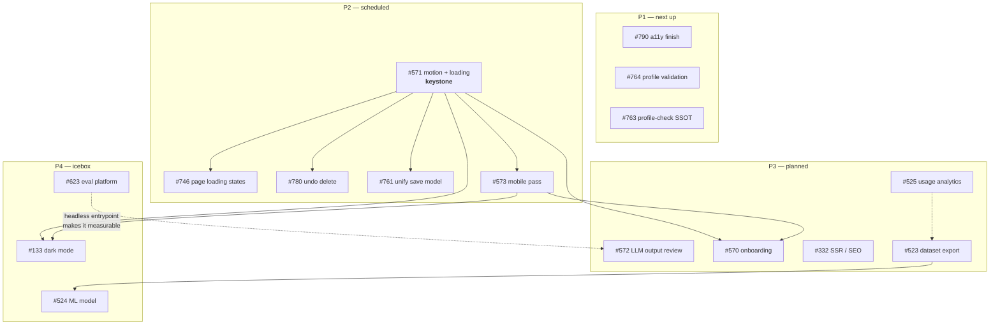

# Open-issue backlog — order and priority

> **Written:** 13 Aug 2026 · **Basis:** all **16** open issues in
> `Smart-Apply/applo`, read in full via `gh issue list --state open`.
> **Verified against:** `main` @ `b0f60c5d` (`feat: security audit remediation
> F9–F19`, PR #791).
>
> Every "current state" line below was re-checked against the code on `main`,
> not copied from the issue body. Where an issue disagrees with the code — or
> with an external source — the disagreement is recorded in
> [Corrections](#corrections-found-while-ordering) rather than propagated.
>
> This file answers *what order and why*. The `NN-*.md` plans next to it answer
> *how*, and [README.md](./README.md) sequences the plans (including four items
> that have no issue at all — see [Not on this list](#not-on-this-list)).

---

## Priority scale

| Priority | Meaning |
|---|---|
| **P1** | Next up. Unblocked, small, and either a correctness/data-loss risk or a legal/accessibility exposure. |
| **P2** | Scheduled. Real product value; either larger, or waiting on a P1/keystone to land first. |
| **P3** | Planned, not scheduled. Valuable but not load-bearing, or its content depends on P2 changing the UX underneath it. |
| **P4** | Icebox. Needs an input that does not exist yet (data volume, a settled design system, a separate repo). |

**Size** is scope, not schedule:

| Size | Scope |
|---|---|
| **S** | One PR, one area, the patterns already exist in the repo. |
| **M** | One or two PRs; introduces a shared primitive or needs a small decision. |
| **L** | Multi-PR, cross-cutting, needs a product decision before code. |
| **XL** | Its own workstream or repository. |

---

## The order

| # | Issue | Title | Prio | Size | Blocked by |
|---:|---|---|---|---|---|
| 1 | [#790](https://github.com/Smart-Apply/applo/issues/790) | a11y: extend the #765 ARIA/focus work to dashboard, applications, settings | **P1** | S | — |
| 2 | [#764](https://github.com/Smart-Apply/applo/issues/764) | Eingabe-Validierung für Profilfelder bauen | **P1** | M | — |
| 3 | [#763](https://github.com/Smart-Apply/applo/issues/763) | Profil-Check sortieren und Abschlusszustand bauen | **P1** | S | — |
| 4 | [#571](https://github.com/Smart-Apply/applo/issues/571) | Übergänge neu designen + Lade-Animationen | **P2** | M | — *(keystone)* |
| 5 | [#746](https://github.com/Smart-Apply/applo/issues/746) | Loading State für die Seite bauen | **P2** | S | #571 |
| 6 | [#780](https://github.com/Smart-Apply/applo/issues/780) | Löschen im Profil umkehrbar machen (Soft-Delete + Undo) | **P2** | S | #571 *(soft)* |
| 7 | [#761](https://github.com/Smart-Apply/applo/issues/761) | Speicher-Modell vereinheitlichen und Erfolgs-Feedback bauen | **P2** | L | #571 + a decision |
| 8 | [#573](https://github.com/Smart-Apply/applo/issues/573) | Mobiles Design (Android/iOS) überarbeiten | **P2** | L | #571 |
| 9 | [#572](https://github.com/Smart-Apply/applo/issues/572) | Generierungs-Output prüfen & Verbesserungspotenziale identifizieren | **P3** | M | measurement |
| 10 | [#570](https://github.com/Smart-Apply/applo/issues/570) | Onboarding-Guide für alle Features | **P3** | L | #571, #573 |
| 11 | [#332](https://github.com/Smart-Apply/applo/issues/332) | Add SSR to public pages (landing, marketing) for SEO | **P3** | M | plan 03 |
| 12 | [#525](https://github.com/Smart-Apply/applo/issues/525) | LLM token-usage analytics aggregation endpoints | **P3** | M | — *(unblocked)* |
| 13 | [#523](https://github.com/Smart-Apply/applo/issues/523) | Anonymized usage dataset export for ML/due-diligence | **P3** | M | re-scope first |
| 14 | [#623](https://github.com/Smart-Apply/applo/issues/623) | Evaluation platform for application generation — separate repo | **P4** | XL | — |
| 15 | [#133](https://github.com/Smart-Apply/applo/issues/133) | 🌙 Dark Mode — Theme Switcher | **P4** | M | #571, #573 |
| 16 | [#524](https://github.com/Smart-Apply/applo/issues/524) | Model trained on anonymized AI-usage dataset (discovery) | **P4** | XL | #523 + data volume |

**Ordering principle:** finish what is already open before starting what is
not. Ranks 1–3 are unblocked, small, and each one closes a defect that is live
in production today. Rank 4 is a keystone — three later issues explicitly say
they should build on it — so it comes before its dependents rather than after,
even though nothing forces that order technically.

---

## P1 — next up

### 1 · #790 — finish the accessibility pass

**What it does.** #765 (PR #784) took `/profile` and the app shell to 0 axe
violations; #759 and #786 cleared contrast everywhere. #790 applies the same
naming-and-structure work to the three routes plan 06 scoped out. The issue
carries the measured baseline: 10 violation nodes — 7 × `button-name`
(critical) across `/dashboard` and `/applications`, 1 × `aria-hidden-focus`
(serious) on `/settings`, plus `aria-allowed-role` and `heading-order`.

**Why P1.** It is the direct continuation of work that merged today, so the
patterns, the harness and the two measurement traps are all written down in the
issue. `button-name` means icon-only controls announce as "button" with no
name; `aria-hidden-focus` means keyboard focus lands on an element the screen
reader has been told does not exist. The BFSG argument from
[plan 06](./06-issue-765-accessibility.md) applies unchanged. Highest value per
unit of work in the whole backlog.

**Note.** The issue records that a **VoiceOver pass has never been done** —
every check so far has been automated. That should happen before anyone claims
WCAG conformance publicly. Fold it in or split it out, but do not lose it.

**Depends on:** nothing. **Plan:** extends [06](./06-issue-765-accessibility.md).

### 2 · #764 — validate the profile editor dialogs

**What it does.** Adds `react-hook-form` + Zod validation to the four profile
editor dialogs that have none: date plausibility (end not before start,
"laufend" excludes an end date), URL format for LinkedIn and project links,
email and phone format, inline errors that name the next step, and a blocked
save on an invalid required field.

**Re-verified on `b0f60c5d`** — the issue's table still holds exactly:

| Dialog | `useForm` / `zodResolver` / `zod` refs |
|---|---:|
| `contact-editor-dialog.tsx` | 4 |
| `certificate-editor-dialog.tsx` | **0** |
| `education-editor-dialog.tsx` | **0** |
| `experience-editor-dialog.tsx` | **0** |
| `project-editor-dialog.tsx` | **0** |

**Why P1.** The profile is the *input* to the generation pipeline. An
implausible date or a malformed URL does not fail loudly — it is rendered into
a PDF the user sends to an employer. Four of five dialogs also deviate from the
repo's stated convention, so this is convergence onto an existing pattern, not
a new one.

**Depends on:** nothing. New strings need all six locale trees.

### 3 · #763 — one source of truth for the profile check

**What it does.** Points `/profile` at `calculateProfileStrength` instead of
recomputing the score, returns the criteria (label, hint, weight) from that one
function, sorts open items to the top, and defines a 100 % completion state.

**Re-verified on `b0f60c5d`** — the duplication is still live:
`dashboard/page.tsx:111` calls `calculateProfileStrength`, while
`profile/page.tsx:865` carries a comment reading *"mirrors
calculateProfileStrength"* above its own criteria array and `reduce`.

**Why P1.** The weights agree *today*, by hand. The next edit to
`profile-utils.ts` makes the dashboard and the profile page show two different
percentages for the same profile, silently, with no test to catch it. Small
refactor, removes a whole class of future bug, and the UX half (sort by
remaining gain, show a finished state) rides along for free.

**Depends on:** nothing.

---

## P2 — scheduled

### 4 · #571 — motion and loading foundation *(keystone)*

**What it does.** Route transitions, a reusable skeleton/loading component set,
a progress animation bound to the SSE generation status, unified
micro-interactions, `prefers-reduced-motion` support.

**Why here, and why before its dependents.** #746 and #573 both say in their own
acceptance criteria that they must be consistent with #571; #780 and #761 both
need a toast/feedback primitive that #571 defines. Landing it first means one
set of primitives instead of four ad-hoc ones. It is the single highest-leverage
scheduling decision in this list.

**Watch:** `apps/web` ships to Cloudflare Workers and the Sentry SDK already
costs ~519 KiB gzipped of the script budget. Any animation dependency needs a
bundle check before merge — see [plan 01](./01-error-monitoring.md).

**Plan:** [07](./07-issue-571-motion-foundation.md).

### 5 · #746 — page loading states

**What it does.** A visible loading state on initial page load and for
data-dependent regions, a reusable skeleton, an error state, and no layout shift
on the transition to loaded content.

**Why P2 and here.** It is essentially #571 applied per route, and the issue
says so. Doing it first would mean inventing the primitive twice.

**Depends on:** #571. **Plan:** [08](./08-issue-746-loading-states.md).

### 6 · #780 — make profile deletion reversible

**What it does.** An undo toast after deleting a profile entry (station, skill,
language, certificate, project), with the deletion held client-side long enough
to restore without a round trip; a confirmation dialog where undo is not
possible.

**Verified premise.** Editing is already reversible — the dialogs have explicit
save/cancel. Deletion is not: the backend's differential update means an entry
missing from the array is removed, and there is no trash or undo anywhere.

**Why P2 rather than P1.** It is a genuine data-loss path on hand-typed data
that feeds generation, which argues for P1. It sits at P2 only because the issue
says it should consume #571's feedback primitives rather than build its own — if
#571 slips, promote this and build the toast locally.

**Depends on:** #571 (soft). Pairs naturally with #761.

### 7 · #761 — unify the save model

**What it does.** Picks *one* save model for the product and justifies it, adds
an "all changes saved" indicator wherever autosave applies, unifies success
feedback, makes save failures visible with a retry, and adds an unsaved-changes
guard wherever explicit saving survives.

**Verified premise.** Three different models coexist: `/profile` saves per
dialog, `/settings` uses a sticky save bar that appears when dirty, and the
application editor autosaves silently via `POST /applications/:id/cover-letter`
(deliberately exempt from the `llm-actions` throttle for exactly that reason).
The issue's original claim of data loss when navigating away from `/profile` is
**not** true — the dialog holds the change until saved or cancelled.

**Why P2 and last of the profile group.** The code is not the hard part; the
product decision is. Making it after #780 and #746 means the decision is taken
with the new feedback primitives already in hand.

**Depends on:** #571 + an explicit decision.

### 8 · #573 — mobile design pass

**What it does.** Touch-sized targets, mobile navigation, mobile-usable profile
and application forms, a PDF preview/editor that works on a small screen, iOS
Safari specifics (safe-area, 100vh, ≥16px inputs to stop input zoom), Android
Chrome checks, optional PWA polish.

**Why P2, and a caveat.** Job seekers browse on phones, so the business case is
strong. But Phase 2 triage already found that part of the premise is stale — the
dashboard shell **already has a drawer and a bottom nav**. Audit first against
`main`, then scope; do not implement the issue as written.

**Depends on:** #571. **Plan:** [09](./09-issue-573-mobile.md).

---

## P3 — planned, not scheduled

### 9 · #572 — review generation output quality

**What it does.** A structured review of the shipped generation output across
several professions (healthcare, sales, trades, marketing, IT) in DE and EN,
categorising weaknesses (faithfulness, ATS coverage, tone, PDF formatting,
cover-letter structure), then writing prioritised follow-ups into
[LLM_OUTPUT_QUALITY.md](../implementation/LLM_OUTPUT_QUALITY.md).

**Why P3 despite being the core product.** Quality work needs a metric that can
resolve the effect, otherwise the conclusion is noise. A per-item pass/fail over
~24 fixtures has a 95 % CI of roughly ±14 pp — wide enough to "detect"
improvements that did not happen. Do this once there is a harness that pools the
underlying findings rather than collapsing them to per-item verdicts; #623's
enabler is that harness.

**Plan:** [10](./10-issue-572-llm-output-review.md).

### 10 · #570 — onboarding guide

**What it does.** A guided first-login tour across profile/résumé import, job
ingestion, generation, the PDF editor, the interview coach and email tracking,
skippable, re-openable, with per-user progress in `user-preferences`.

**Why P3.** Large, and it documents the exact UX that #571, #746, #573 and #761
are about to change. Building it now guarantees rework. It also still has two
open design questions in the issue (interactive tour vs. static checklist; a
library vs. existing primitives) — decide those before planning.

### 11 · #332 — SSR for public pages

**What it does.** Converts the landing/marketing pages from client rendering to
Server Components with real `metadata`/OpenGraph, for indexability and FCP.

**Why P3.** It overlaps [plan 03](./03-seo-og.md), which covers SEO and social
share assets and is cheaper. Fold #332 in only if plan 03 shows the landing
page's CSR is actually hurting indexing — measure before rewriting.

### 12 · #525 — admin LLM usage analytics endpoints

**What it does.** Read-only, admin-gated aggregation over `LlmUsageEvent` —
tokens, cost, call counts and success rate grouped by feature, tier, language
and day, under `/api/v1/admin/llm-usage/*` behind the existing `ADMIN_EMAILS`
allow-list.

**Status change.** Its blocker **#522 is merged** (PR #781), so this is now
unblocked. `LlmUsageEvent` rows exist and are being written.

**Why P3.** Nothing depends on it, and there is not much data yet. It becomes
useful in proportion to how long tracking has been running — which is an
argument for doing it later, not sooner.

**Constraint to carry over:** aggregates only. No drill-down that could resolve
an `actorHash` back to a user.

### 13 · #523 — usage dataset export

**What it does.** An admin-only export of `LlmUsageEvent` to CSV/Parquet/JSONL,
with the schema and its anonymity guarantees documented for due diligence.

**Why it needs re-scoping before it is worked.** The issue's central promise —
"demonstrably anonymous" — is no longer accurate. The F11 finding in the
13 Aug security audit established that the dataset is **pseudonymous**:
`actorHash` is stable per user, and neighbouring tables (`applications`,
`validations`, `interview_sessions`) carry `userId` plus millisecond
`createdAt`, so a usage burst time-correlates back to the triggering row
*without* the salt. That is why erasure-on-account-deletion and a retention
sweep were added. An export sold as anonymous would be wrong.

**Re-scope to:** timestamp bucketing, `actorHash` re-salting or dropping per
export, and a k-anonymity threshold — or state plainly that the artefact is
pseudonymous and handle it as personal data.

---

## P4 — icebox

### 14 · #623 — evaluation platform

**What it does.** A standalone repo that runs a versioned fixture set
(profile × job posting, DE/EN, across professions and edge cases) through the
generation pipeline under a matrix of variants — model per call, prompt version,
reasoning effort, params, pipeline toggles — and scores each on quality, cost
and latency against a baseline. Its one in-repo enabler is a headless,
config-driven `generate(profileJson, jobJson, config)` with no persistence.

**Why P4 — and why the urgency argument in the issue does not hold.** The issue
justifies "why now" with `gpt-4.1` being retired on **2026-10-14**. That date
belongs to `gpt-4.1-nano`. Per Microsoft's
[model retirement schedule](https://learn.microsoft.com/azure/foundry/openai/concepts/model-retirement-schedule),
`gpt-4.1` (version `2025-04-14`) is Deprecated with retirement on
**2027-04-14**, replacement `gpt-5.1`. Applo's main lane runs `gpt-4.1`, so the
forcing function is roughly twenty months out, not two.

**But split the enabler out.** The headless entrypoint is worth having on its
own — it is what makes #572 measurable, and a branch already exists
(`feat/headless-generation`, worktree at
`…/smart-apply.worktrees/headless-generation`). Consider filing the enabler as
its own issue at **P3** and leaving #623 as the umbrella for the separate repo.

**Reference:** [EVAL_PLATFORM_FABLE5_PROMPT.md](../implementation/EVAL_PLATFORM_FABLE5_PROMPT.md).

### 15 · #133 — dark mode

**What it does.** Light/dark/system themes, persisted preference, a toggle,
Tailwind class-based dark mode.

**Why P4.** Labelled `low-priority` + `post-mvp` by its author, and #571/#573
are about to move the design tokens it would be written against. Doing it before
they land means doing it twice. It is also the one issue here whose body still
references `tailwind.config.ts` — the app is on **Tailwind v4**, which is
config-less by default, so the technical plan in the issue needs rewriting
regardless.

### 16 · #524 — ML on the usage dataset

**What it does.** A discovery umbrella: token-cost forecasting, per-`actorHash`
sequence modelling, tier-upgrade propensity, anomaly detection — trained only on
the anonymized export.

**Why P4.** Two hard preconditions: #523 must exist, and enough data must have
accumulated to make modelling worth anything. Tracking started with PR #781 on
13 Aug 2026. The issue itself says to keep it open as an umbrella until then —
that is the correct state; leave it there.

---

## Dependency graph



---

## Corrections found while ordering

Four claims in issue bodies did not survive verification. They are recorded
here rather than silently fixed, because each one changes a decision.

| Issue | Claim | What is actually true |
|---|---|---|
| #623 | `gpt-4.1` retires **2026-10-14**, so model migration is urgent | That is `gpt-4.1-nano`'s date. `gpt-4.1` (`2025-04-14`) retires **2027-04-14** per [Microsoft's schedule](https://learn.microsoft.com/azure/foundry/openai/concepts/model-retirement-schedule). Removes the deadline pressure that justified "why now". |
| #523 | The `LlmUsageEvent` dataset is anonymous | It is **pseudonymous**. Finding F11 of the 13 Aug audit shows `actorHash` + neighbouring timestamped tables re-identify a user without the salt. Erasure + retention were added for this reason. |
| #525 | Blocked on #522 | #522 merged in PR #781 — **unblocked**. |
| #133 | Configure dark mode in `tailwind.config.ts` | The app runs **Tailwind v4**, config-less by default. The issue's technical section predates the upgrade. |

Two more premises are stale but already recorded in
[plan 05](./05-issue-triage-758-765.md): #573's mobile navigation partly exists,
and #761's "data loss when navigating away from `/profile`" does not happen.

---

## Not on this list

Two categories of real work carry **no GitHub issue**, so they are invisible to
anyone reading the tracker. Ordering the issues alone will therefore under-serve
them.

**Plans without issues** — from
[PUBLIC_LAUNCH_PLAN.md](../guides/PUBLIC_LAUNCH_PLAN.md) via
[README.md](./README.md):

| Plan | Status |
|---|---|
| [02 — product analytics](./02-product-analytics.md) | Deliberately skipped. Worth one reconsideration: without it, the P2 UX work above cannot be evaluated. |
| [03 — SEO + social share assets](./03-seo-og.md) | Not started. Cheap, and every social share currently pays for its absence. Overlaps #332. |
| [04 — payments: in or out](./04-payments-decision.md) | Not started. A decision, not an implementation — the frontend already implies a paid tier with no checkout behind it. |

**Security leftovers** from
[SECURITY_AUDIT_2026-08-13.md](../security/SECURITY_AUDIT_2026-08-13.md), scoped
out of PR #791 by design (§9.5):

- `apps/web` — `KpiCard` un-sanitized sink hardening, and the CSP posture
  (`unsafe-inline`/`unsafe-eval`, documented as deliberate in
  `apps/web/src/middleware.ts:86-105`).
- Dependency bumps (§7) — hygiene, not urgent; no High advisory is
  runtime-reachable. Note the `pdfjs-dist` ↔ `react-pdf` pairing rule before
  touching them.

File issues for whichever of these are real, or accept that they will not be
prioritised alongside everything else.

---

## Keeping this current

This file goes stale the moment an issue is closed or re-scoped. Refresh the
open set with:

```bash
gh issue list --repo Smart-Apply/applo --state open --limit 200 \
  --json number,title,labels,createdAt \
  --jq '.[] | "#\(.number)\t[\([.labels[].name]|join(","))]\t\(.title)"'
```

Two habits keep it honest:

- **Re-verify before you work an issue, not before you file it.** Six of the
  sixteen issues here describe code that has since changed. The cost of
  checking is minutes; the cost of not checking is a PR against a premise that
  no longer holds.
- **Record disagreements in the issue.** When verification contradicts a body,
  comment on the issue — otherwise the next reader repeats the work.
